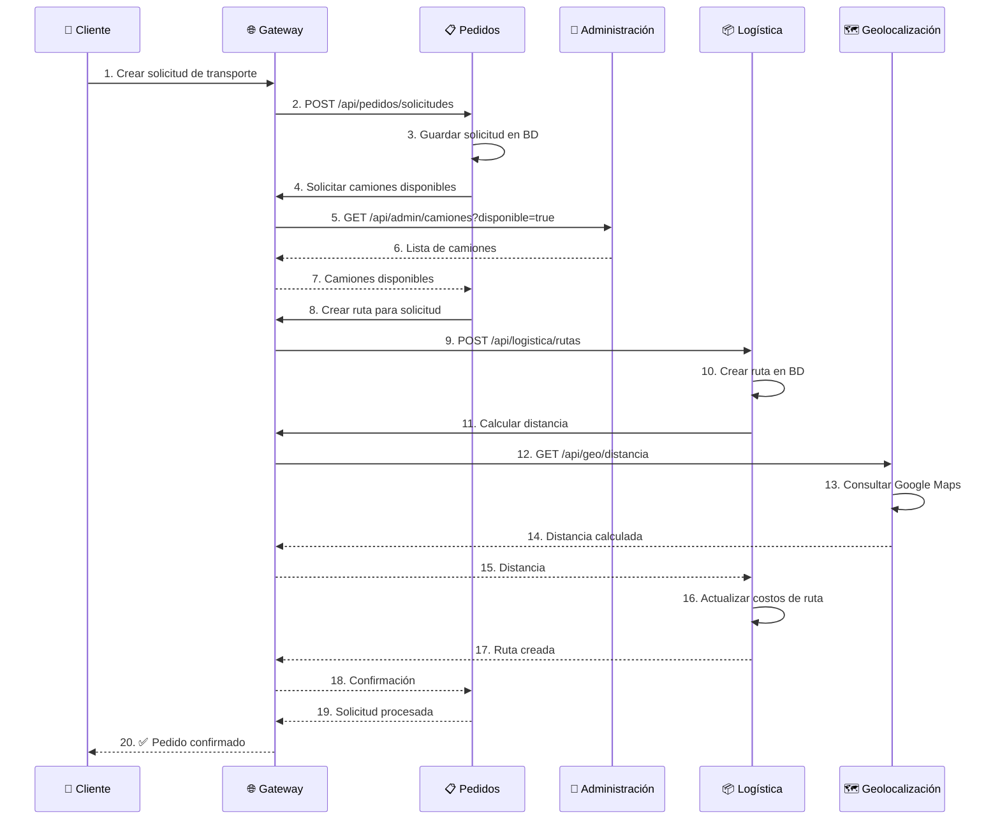
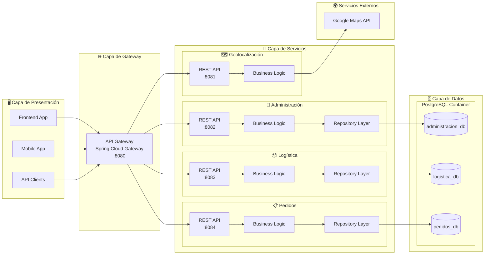
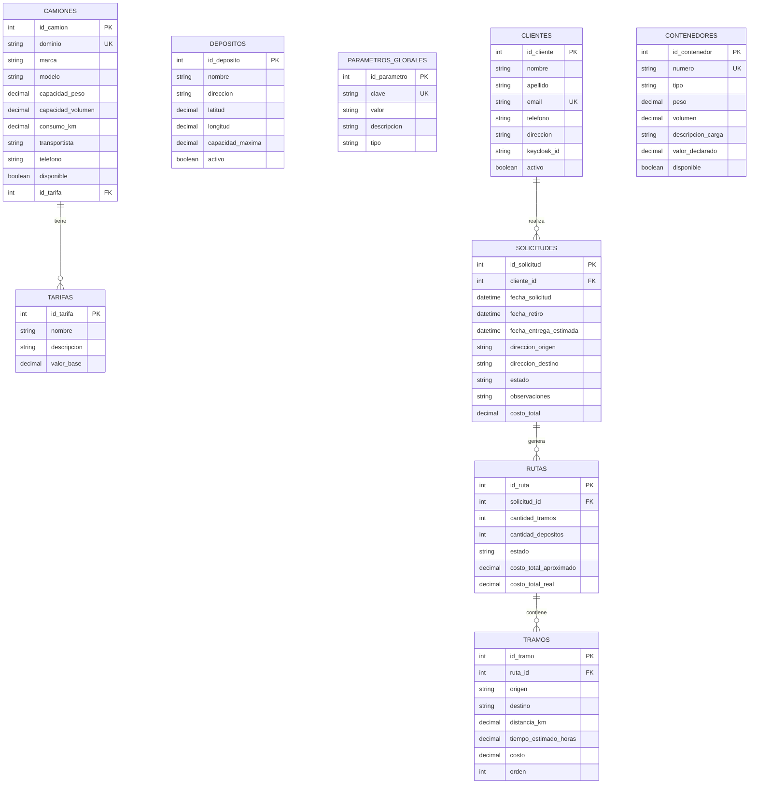
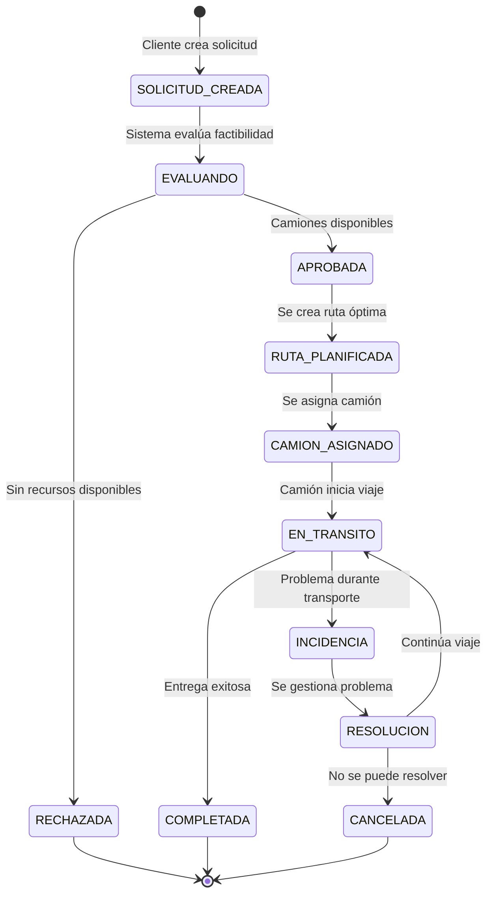
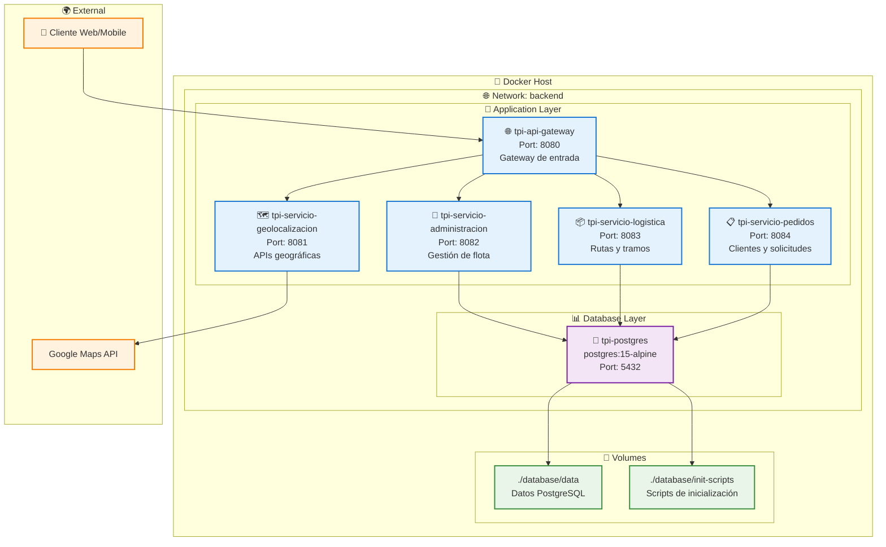
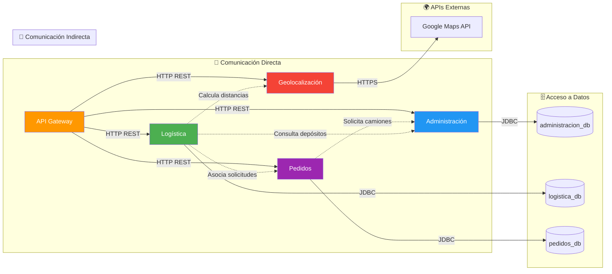
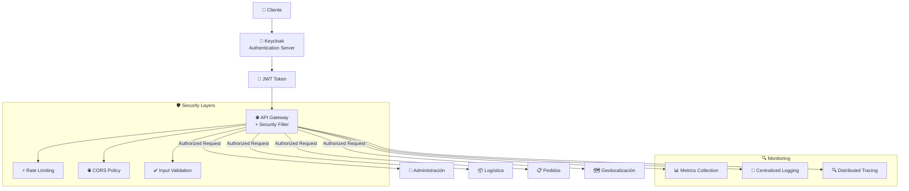
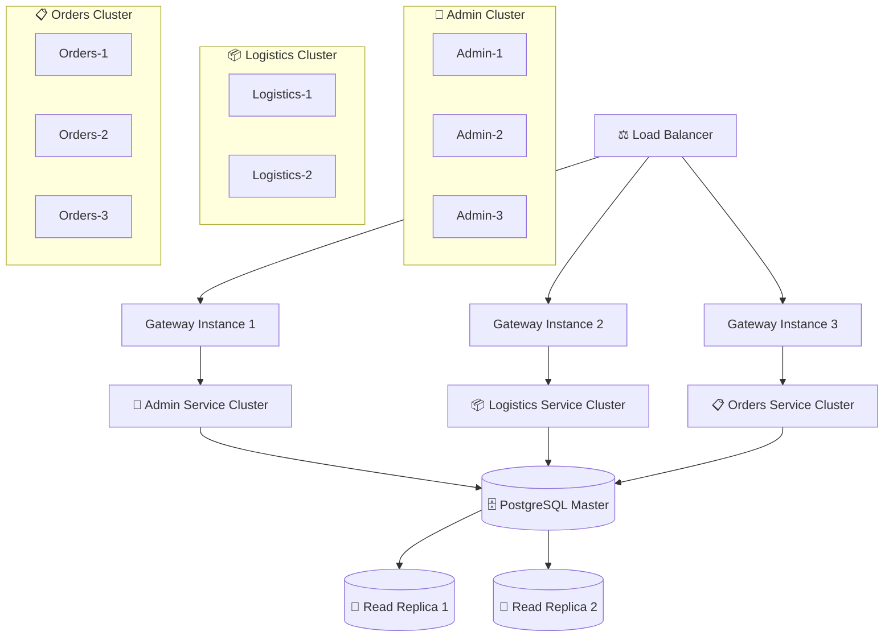
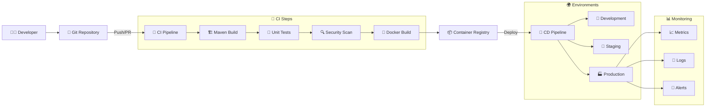

# 🏗️ Diagramas de Arquitectura - Sistema TPI Backend

## 🎯 **Arquitectura de Alto Nivel**

```mermaid
graph TB
    Client[👤 Cliente/Frontend] --> Gateway[🌐 API Gateway<br/>:8080]
    
    Gateway --> Admin[🏢 Servicio Administración<br/>:8082]
    Gateway --> Logistics[📦 Servicio Logística<br/>:8083]  
    Gateway --> Orders[📋 Servicio Pedidos<br/>:8084]
    Gateway --> Geo[🗺️ Servicio Geolocalización<br/>:8081]
    
    Admin --> DB1[(🗃️ administracion_db)]
    Logistics --> DB2[(🗃️ logistica_db)]
    Orders --> DB3[(🗃️ pedidos_db)]
    
    DB1 -.-> Postgres[🐘 PostgreSQL<br/>:5432]
    DB2 -.-> Postgres
    DB3 -.-> Postgres
    
    Geo --> GoogleAPI[🌍 Google Maps API]
    
    classDef service fill:#e1f5fe,stroke:#0277bd,stroke-width:2px
    classDef database fill:#f3e5f5,stroke:#7b1fa2,stroke-width:2px
    classDef external fill:#fff3e0,stroke:#f57c00,stroke-width:2px
    
    class Gateway,Admin,Logistics,Orders,Geo service
    class DB1,DB2,DB3,Postgres database  
    class Client,GoogleAPI external
```

---

## 🔄 **Flujo de Comunicación Entre Servicios**



---

## 🏗️ **Arquitectura de Microservicios Detallada**



---

## 🗃️ **Modelo de Datos - Vista General**



---

## 🔄 **Estados y Flujos de Negocio**



---

## 🐳 **Arquitectura de Contenedores Docker**



---

## 📡 **Matriz de Comunicación Entre Servicios**



---

## 🔐 **Arquitectura de Seguridad (Futura)**



---

## 📈 **Arquitectura de Escalabilidad**



---

## 🔄 **Pipeline de CI/CD (Conceptual)**



---

**📐 Diagramas generados con:** Mermaid  
**📅 Última actualización:** Noviembre 2025  
**🎨 Estilo:** Material Design + TPI Branding